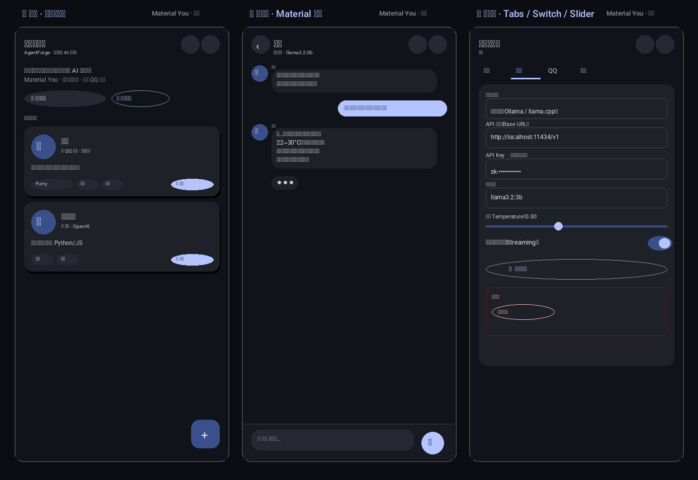

# 🤖 智能体管家 · AgentForge

一个运行在安卓上的 **AI 智能体管理软件**，让你在手机上自由地：

- ➕ **创建 / 删除** AI 智能体
- ✍️ **自由设置智能体设定**（系统提示词、开场白、头像、标签）
- 🧠 **配置模型**：OpenAI 兼容、DeepSeek、Kimi、以及**本地模型**（Ollama / llama.cpp）
- 💬 **接入 QQ**：通过 OneBot 中继（go-cqhttp / qq-relay）让智能体在 QQ 群/私聊中回复
- 📦 **导出 / 导入**备份，数据完全保存在本机

> 本项目为 **PWA + Capacitor** 架构：同一套代码，既能当网页 / 手机浏览器 App 使用，
> 也能一键打包成真正的 **Android APK**。数据默认只存在本机，不上传任何服务器
> （除非你主动配置了远端模型或 QQ 中继）。

---

## ✨ 功能一览

| 模块 | 说明 |
|------|------|
| 智能体管理 | 创建、编辑、删除、复制、标签分类 |
| 设定配置 | 名称 / 头像(Emoji) / 简介 / System Prompt / 开场白 |
| 模型配置 | OpenAI 兼容、DeepSeek、Kimi、Ollama 本地、自定义端点 |
| 参数调节 | Temperature / Max Tokens / Top P / 流式输出 |
| 聊天对话 | 内置聊天界面，支持 Markdown 渲染、流式打字 |
| QQ 接入 | OneBot v11 中继，支持群聊 & 私聊，可测试连接 |
| 数据存储 | localStorage（Web）/ SharedPreferences（App） |
| 备份 | 导出 / 导入 JSON，一键清空 |

## 🎨 Material Design 3 界面

本应用采用 **Material You（Material Design 3）** 设计规范重构，提供现代化的安卓原生质感：

- **语义色槽**：`--md-sys-*` 色槽系统，深色 / 浅色主题无缝切换，符合 M3 色彩对比度标准
- **形状系统**：四级圆角（4 / 8 / 12 / 16 / 28dp），层级越高圆角越大
- **组件库**：FAB、Top App Bar（Large 变体）、Segmented Tabs、Filled/Tonal/Outlined/Text/Elevated 按钮、
  Switch、Slider、Snackbar、Alert/Confirm 对话框、Bottom Sheet、Menu、Card（filled/elevated/outlined）
- **Material Symbols**：采用 Google Material Symbols（Outlined）图标，矢量清晰
- **动效**：遵循 M3 运动曲线（`cubic-bezier(0.2, 0, 0, 1)`），含页面切换、涟漪、打字指示器等



> 左：智能体列表（Large App Bar + FAB + 卡片网格）｜ 中：聊天页（Material 气泡 + Composer）｜
> 右：编辑器（Tabs + Switch + Slider + 危险区）

---

## 🚀 快速开始

### 网页 / PWA 版（已部署 ✅）

直接访问：**https://excuse-2580.github.io/agentforge/**

> 在手机浏览器打开 → 点「安装」或 Safari「添加到主屏幕」，即可当作原生 App 使用。

源码仓库：**https://github.com/excuse-2580/agentforge**

### 本地运行

```bash
git clone https://github.com/excuse-2580/agentforge.git
cd agentforge
python3 -m http.server 8080
# 访问 http://localhost:8080
```

## 📱 打包安卓 APK

有两种方式：

### 方式一：GitHub Actions 自动构建（推荐）

push 到 `main` 分支后，Actions 会自动构建 APK 并部署 Pages；打 Tag 还会发布 Release。
> ⚠️ 若使用 fine-grained 个人令牌，需在 GitHub 仓库 Settings → Actions 中确认 `GITHUB_TOKEN`
> 具有 **Contents: read-write**、**Pages: read-write** 权限。

### 方式二：本地构建

```bash
cd agentforge
npm install
npx cap add android    # 首次添加安卓平台
npx cap sync
npx cap open android   # 用 Android Studio 打开，点 Run 即可生成 APK
# 或命令行：
cd android && ./gradlew assembleDebug
# 输出：android/app/build/outputs/apk/debug/app-debug.apk
```

> 前置：Node.js ≥ 18，JDK 17，Android SDK。
> 安卓权限（`AndroidManifest.xml`）见 `android-config.xml`：需 `INTERNET` 与 `usesCleartextTraffic="true"`（访问本地模型 / 自建中继需要）。

## 🔌 QQ 接入说明

QQ 接入需要一个运行中的「中继服务」把消息转给 QQ 机器人（OneBot 协议，如 go-cqhttp）。

仓库内 `qq-relay/` 提供了一个开箱即用的 Node 中继示例：

1. 在一台服务器（或本机）启动 go-cqhttp，开启 HTTP API（默认 `:5700`）
2. 启动 `qq-relay/index.js`，它会：
   - 接收来自本 App 的智能体回复请求
   - 通过 OneBot 把消息发到指定 QQ 群 / 好友
3. 在 App 的「QQ 接入」页填：中继地址 + Token + 目标群号

```
QQ 用户 → QQ 机器人(go-cqhttp) → qq-relay → AgentForge App
                                        ↕ 智能体推理（本地 or API）
```

## 🧠 本地模型

App 通过 **OpenAI 兼容端点** 对接本地模型：

- **Ollama**：默认 `http://localhost:11434/v1`，模型如 `llama3.2:3b`
  - 安卓模拟器访问宿主：`http://10.0.2.2:11434/v1`
  - 真机：填电脑局域网 IP，如 `http://192.168.1.100:11434/v1`
- **llama.cpp server**：`--host 0.0.0.0 --port 8080`，端点 `/v1`
- 手机端跑本地模型：可用 [MLC LLM](https://llc.ai) 等，把端点填进 App 即可

> 首次进入 App 会自动创建示例智能体「小夜」，默认指向本地 Ollama，
> 你只需把 API 地址 / Key / 模型名改成自己可用的即可。

## 📂 项目结构

```
agentforge/
├── index.html              # 入口（引入 Material Symbols 字体）
├── css/style.css           # Material Design 3 样式（深色/浅色双主题 + 全部组件）
├── js/
│   ├── app.js              # 主逻辑、路由、状态管理
│   ├── ui.js               # M3 组件库（Snackbar/Dialog/Sheet/Menu/Switch/Slider/FAB…）
│   ├── storage.js          # 数据持久化（localStorage）
│   ├── llm.js              # 模型调用（OpenAI 兼容 / 流式 SSE）
│   └── qq.js               # QQ 中继客户端
├── manifest.webmanifest     # PWA 配置
├── sw.js                   # Service Worker（离线缓存）
├── capacitor.config.json   # Capacitor 安卓配置
├── android-config.xml      # 安卓权限/配置说明
├── assets/                 # 图标（icon.svg / .png）
├── qq-relay/               # QQ 接入中继服务（Node.js / OneBot）
├── .github/workflows/      # 自动构建 APK & 部署 Pages
├── _md_verify.js           # 无头 DOM 渲染验证（jsdom）
├── _design_preview.py      # Material Design 设计预览图生成
└── README.md
```

## 🛡️ 隐私

- 所有智能体设定、对话记录默认**只保存在本机**
- API Key 存储在本地，仅在你发消息时直连模型服务商
- 不收集任何用户数据

## 📜 开源协议

MIT License — 随便改，随便用 🐾
